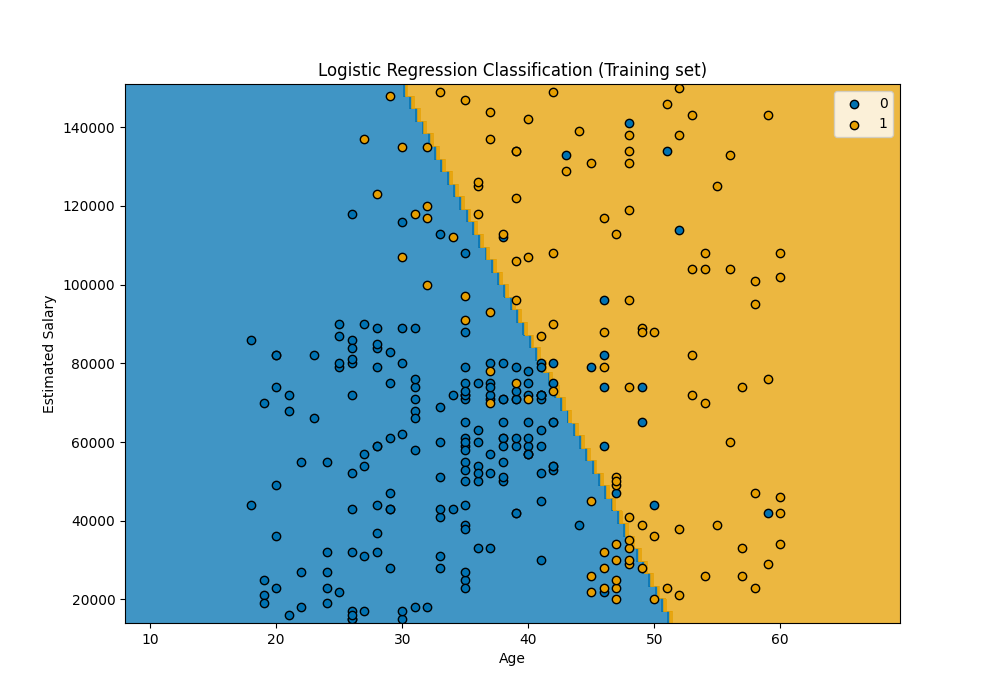

# Machine Learning Model Comparison for Car Purchase Prediction

## Dataset Overview

This project uses the Social_Network_Ads.csv dataset to predict whether a client from a car company will purchase a new car based on their age and estimated salary. The dataset contains the following features:

- Age: Client's age
- EstimatedSalary: Client's estimated salary
- Purchased: Whether the client purchased a car (1) or not (0)

## Model Comparison

I implemented and compared seven different machine learning models to predict car purchases. Here's a summary of their performance:

| Model | Accuracy | Precision (Class 0) | Recall (Class 0) | Precision (Class 1) | Recall (Class 1) |
|-------|----------|---------------------|------------------|---------------------|------------------|
| Logistic Regression | 89% | 0.89 | 0.96 | 0.89 | 0.75 |
| K-Nearest Neighbors | 93% | 0.96 | 0.94 | 0.88 | 0.91 |
| Support Vector Machine | 90% | 0.89 | 0.97 | 0.92 | 0.75 |
| Kernel SVM | 93% | 0.96 | 0.94 | 0.88 | 0.91 |
| Naive Bayes | 90% | 0.90 | 0.96 | 0.89 | 0.78 |
| Decision Tree | 91% | 0.95 | 0.91 | 0.83 | 0.91 |
| Random Forest | 91% | 0.94 | 0.93 | 0.85 | 0.88 |

### Model Performance Analysis

1. **K-Nearest Neighbors** and **Kernel SVM** achieved the highest accuracy (93%) among all models. They showed balanced performance for both classes, with high precision and recall.

2. **Logistic Regression** had the lowest accuracy (89%) but showed good performance in identifying non-purchasers (Class 0) with high recall (0.96).

3. **Support Vector Machine** (linear kernel) performed well in identifying non-purchasers (0.97 recall for Class 0) but had lower recall for purchasers (0.75 for Class 1).

4. **Naive Bayes** showed similar performance to the linear SVM, with high recall for Class 0 (0.96) and lower recall for Class 1 (0.78).

5. **Decision Tree** and **Random Forest** both achieved 91% accuracy, with Random Forest showing a slightly more balanced performance across both classes.

### Visualizations

To better understand the performance of each model, we have generated confusion matrices and decision boundary plots for both training and test sets.

#### Confusion Matrices

<table>
  <tr>
    <td></td>
    <td></td>
  </tr>
  <tr>
    <td></td>
    <td></td>
  </tr>
  <tr>
    <td></td>
    <td></td>
  </tr>
  <tr>
    <td></td>
    <td></td>
  </tr>
</table>

#### Decision Boundaries

##### Training Set

<table>
  <tr>
    <td></td>
    <td></td>
  </tr>
  <tr>
    <td></td>
    <td></td>
  </tr>
  <tr>
    <td></td>
    <td></td>
  </tr>
  <tr>
    <td></td>
    <td></td>
  </tr>
</table>

##### Test Set

<table>
  <tr>
    <td></td>
    <td></td>
  </tr>
  <tr>
    <td></td>
    <td></td>
  </tr>
  <tr>
    <td></td>
    <td></td>
  </tr>
  <tr>
    <td></td>
    <td></td>
  </tr>
</table>

## Conclusion

Based on the results, we can conclude:

1. **K-Nearest Neighbors** and **Kernel SVM** are the best performing models for this dataset, with the highest accuracy and balanced performance across both classes.

2. **Logistic Regression**, while having the lowest overall accuracy, still performs well in identifying non-purchasers. This could be useful if the cost of false negatives (missing potential buyers) is higher than the cost of false positives.

3. **Decision Tree** and **Random Forest** models show good overall performance and may provide more interpretable results, especially the Decision Tree model.

4. The **Naive Bayes** model, despite its simplicity, performs competitively with more complex models like SVM, making it a good baseline model for this problem.

5. The linear **Support Vector Machine** shows a bias towards identifying non-purchasers, which might not be ideal if identifying potential buyers is the primary goal.

When choosing a model for deployment, one should consider not only the overall accuracy but also the specific requirements of the business problem. For example, if identifying potential buyers is more critical than avoiding false positives, it might be more relevant to prioritize models with higher recall for Class 1.

Additionally, consider the interpretability of the model. While K-Nearest Neighbors and Kernel SVM perform best, they may be harder to interpret than a Decision Tree or Logistic Regression models.

Lastly, these results are based on a single train-test split. For a more robust evaluation, one should always consider using cross-validation and possibly hyperparameter tuning to optimize each model's performance. But for the goal of this project the current implementation was more than sufficient.